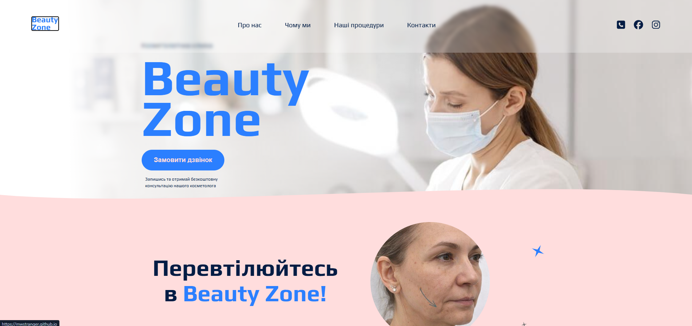
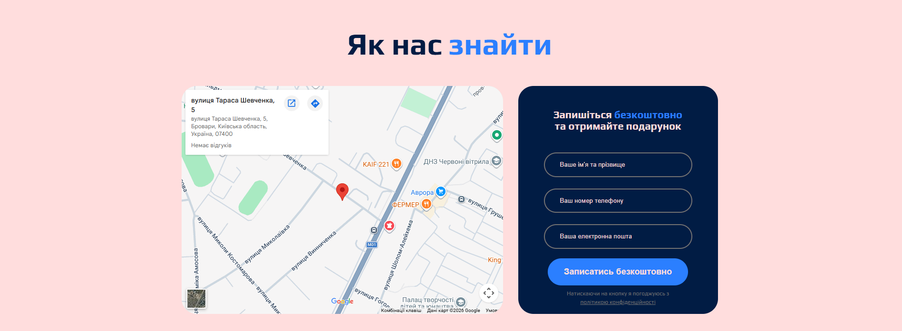

Project name // GENIUS :: Beauty zone
Test-drive project created as part of the “GENIUS :: Fullstack Web Development”
course.
This project represents a modern responsive web application built to practice
frontend fundamentals, layout structuring, and Git/GitHub workflow.

Live Demo // 
🔗 https://mwstranger.github.io/genius_beauty_zone/

Features //
- Fully responsive design (mobile, tablet, desktop)
- Modern layout built with
- Flexbox
- Clean and semantic HTML structure
- Basic interactivity using vanilla JavaScript

Technologies Used //
- HTML5
- CSS3 / SCSS
- BEM
- Flexbox
- JavaScript (vanilla)
- Git & GitHub

Screenshots // 

What I Learned //
- SCSS fundamentals (nesting, structure, basic workflow)
- Responsive web design principles Working with Git and GitHub (repositories,
  commits, deployment)
- Clean and valid code according to HTML5 standards
- BEM methodology for classes

Next Steps //
- Frontend:
* Improve JavaScript skills Add dynamic UI interactions
* Implement form validation Work with asynchronous logic (fetch / API basics)
* Improve code structure and scalability
- Backend:
* Learn backend fundamentals
* Build simple REST APIs
* Work with databases Implement basic authentication
* Connect frontend with backend services

Project Status //
This is a learning / demo project created for educational purposes.

Data //
January 2026 — March 2026

Links //
LinkedIn: 🔗 https://www.linkedin.com/in/mwstranger/

Author // 
MWS 
Om
